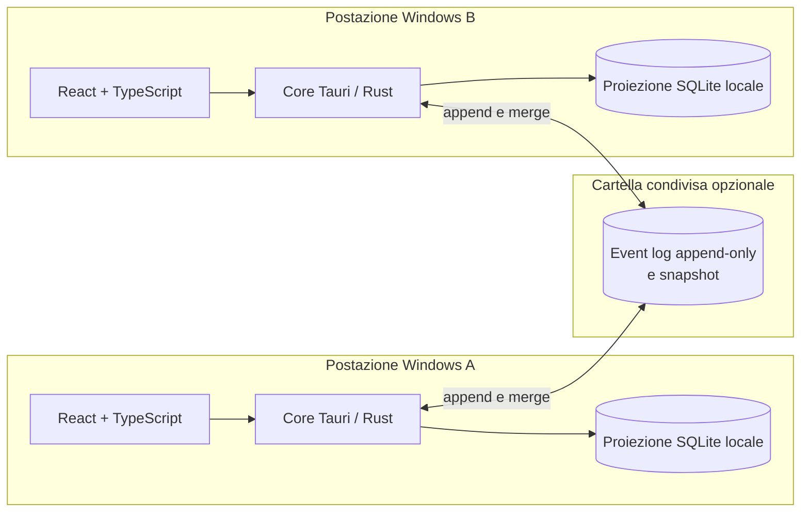

<div align="center">


# Gestionale PharmaTek Demo

**Un gestionale Windows local-first che segue l'intero lavoro: dall'inserimento dell'ordine fino alla produzione, alla spedizione e all'incasso.**

[English](README.md) · [**Italiano**](README.it.md)

<br />


</div>

> [!IMPORTANT]
> Questa è l'edizione dimostrativa pubblica. Non contiene dati operativi aziendali, contatti, prezzi, codici fornitore, provvigioni o coordinate finanziarie. Le anagrafiche iniziali sono vuote e configurabili localmente dall'applicazione.

<a href="docs/screenshots/readme/dashboard.webp">
  
</a>

## Cos'è Gestionale PharmaTek?

Gestionale PharmaTek è un'applicazione desktop che riunisce giornaliero ordini, produzione, spedizioni, pagamenti, provvigioni e anagrafiche in un unico flusso di lavoro.

Un ordine inserito nel **Giornaliero** fornisce i dati alla **Produzione**, diventa disponibile nelle **Spedizioni** e rimane collegato ai movimenti attesi e incassati della **Contabilità**. Dashboard, azioni suggerite e promemoria condivisi rendono visibile ciò che deve ancora essere completato.

Il programma funziona su Windows e rimane utilizzabile anche senza connessione. Ogni postazione usa una proiezione SQLite locale e veloce; le modifiche possono essere scambiate attraverso una cartella condivisa. Non serve un server applicativo centrale.

## Dall'ordine all'incasso

| Passaggio | Dove | Cosa succede |
|---:|---|---|
| 1 | **Giornaliero** | Crei o modifichi l'ordine, scegli le anagrafiche, aggiungi i prodotti e definisci prezzi, acconto e saldo. |
| 2 | **Produzione** | Selezioni le righe complete, inserisci i dati richiesti dal laboratorio e crei il lotto. |
| 3 | **Spedizioni** | Raggruppi i prodotti per destinatario, prepari i colli ed esporti o stampi i dati del corriere. |
| 4 | **Contabilità** | Controlli i pagamenti attesi e gestisci incassi, rate, provvigioni e rimborsi. |

Ogni salvataggio aggiorna le viste collegate, evitando di riscrivere lo stesso ordine in più file indipendenti.

## Il programma

<table>
<tr>
<td width="50%" valign="top">
<a href="docs/screenshots/readme/orders.webp"></a><br />
<sub><b>Giornaliero.</b> Ricerca, filtri, stato operativo, totale, incassato e residuo nello stesso registro.</sub>
</td>
<td width="50%" valign="top">
<a href="docs/screenshots/readme/order-editor.webp"></a><br />
<sub><b>Inserimento guidato.</b> Prodotti, acconto, saldo e scadenze vengono ricalcolati dai dati salvati.</sub>
</td>
</tr>
<tr>
<td width="50%" valign="top">
<a href="docs/screenshots/readme/production.webp"></a><br />
<sub><b>Produzione.</b> Gli ordini da preparare sono separati dai lotti già in lavorazione.</sub>
</td>
<td width="50%" valign="top">
<a href="docs/screenshots/readme/shipping.webp"></a><br />
<sub><b>Spedizioni.</b> Preparazione dei colli, controllo dei destinatari e storico delle spedizioni.</sub>
</td>
</tr>
<tr>
<td width="50%" valign="top">
<a href="docs/screenshots/readme/accounting.webp"></a><br />
<sub><b>Contabilità.</b> Movimenti attesi, scaduti e incassati rimangono collegati all'ordine e al conto.</sub>
</td>
<td width="50%" valign="top">
<a href="docs/screenshots/readme/records.webp"></a><br />
<sub><b>Anagrafiche condivise.</b> Clienti, medici, agenti, prodotti, conti e corrieri alimentano gli altri moduli.</sub>
</td>
</tr>
<tr>
<td width="50%" valign="top">
<a href="docs/screenshots/readme/spotlight.webp"></a><br />
<sub><b>Spotlight.</b> Cerca ordini e anagrafiche oppure avvia un comando da qualsiasi sezione.</sub>
</td>
<td width="50%" valign="top">
<a href="docs/screenshots/readme/settings.webp"></a><br />
<sub><b>Impostazioni e sicurezza.</b> Notifiche, importazioni, backup, aspetto e preferenze della postazione.</sub>
</td>
</tr>
</table>

## Funzioni principali

| Area | Funzioni |
|---|---|
| **Dashboard** | Indicatori per anno, grafici, azioni suggerite, bacheca e promemoria ricorrenti. |
| **Ordini** | Diversi flussi prodotto, stati, urgenze, prezzi, acconti, rate e note. |
| **Produzione** | Code Da produrre/In lavorazione, dati obbligatori, lotti, numerazioni e date previste. |
| **Spedizioni** | Gruppi per destinatario, colli, contrassegno, profili corriere, export e storico. |
| **Contabilità** | Movimenti attesi e incassati, rate, provvigioni, rimborsi e riconciliazione. |
| **Comunicazioni** | Email e messaggistica, modelli condivisi, campagne locali e retry controllato. |
| **Anagrafiche** | Clienti, medici, agenti, prodotti, conti e corrieri, con importazione e deduplicazione. |
| **Gestione del sistema** | Backup, ripristino coordinato, aggiornamenti pubblici firmati e novità in-app. |

## Perché local-first?

- **Uso quotidiano rapido:** tabelle e ricerche leggono una proiezione SQLite locale.
- **Continuità offline:** un'interruzione temporanea della rete non blocca l'inserimento dei dati.
- **Nessun server applicativo centrale:** una cartella condivisa può scambiare le modifiche tra le postazioni autorizzate.
- **Modifiche convergenti:** i log append-only vengono uniti per campo con regole Last-Write-Wins e Hybrid Logical Clock.
- **Recupero su più livelli:** snapshot, backup, ripristino coordinato e Cestino rispondono a esigenze diverse.



## Protezioni della demo pubblica

- Nome e identifier separati: `Gestionale PharmaTek Demo` / `it.pharmatek.gestionale.demo`.
- Anagrafiche iniziali vuote per clienti, medici, agenti, conti e corrieri nominativi.
- Tassonomia dei prodotti mantenuta, con prezzi e codici fornitore vuoti.
- Identificativi documentali sintetici come `Cliente Demo 001`, `Medico Demo 001` e `Paziente Demo 001`.
- Download anonimo dalle GitHub Releases pubbliche, senza token updater nel frontend.
- Funzioni Premium disponibili localmente e nessun controllo remoto.

Ulteriori dettagli sono disponibili in [`docs/DEMO.md`](docs/DEMO.md).

## Avvio per lo sviluppo

### Prerequisiti

- Node.js e npm
- Rust e Cargo tramite [rustup](https://rustup.rs)
- Visual Studio C++ Build Tools per il linker MSVC
- Microsoft Edge WebView2, normalmente già presente su Windows 11

### Avviare l'applicazione

```powershell
npm install
npm run app:dev
```

Per avviare soltanto l'interfaccia nel browser usa `npm run dev`.

### Verificare una modifica

```powershell
npm test
npm run build
cargo test --manifest-path src-tauri/Cargo.toml
npm run audit:public
```

## Struttura del repository

```text
src/                     interfaccia React e TypeScript
src-tauri/               core Rust e integrazione desktop Tauri
scripts/                 sviluppo, verifica, build e pubblicazione
docs/                    note della demo pubblica e dataset sintetico
```

## Licenza

Non viene concessa alcuna licenza. Il repository non contiene intenzionalmente un file `LICENSE`.

---

<div align="center">
<sub>Gestionale PharmaTek Demo · Una variante pubblica dimostrativa priva di dati operativi.</sub>
</div>
