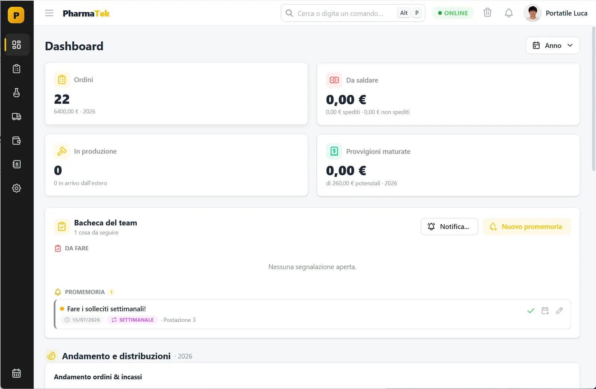
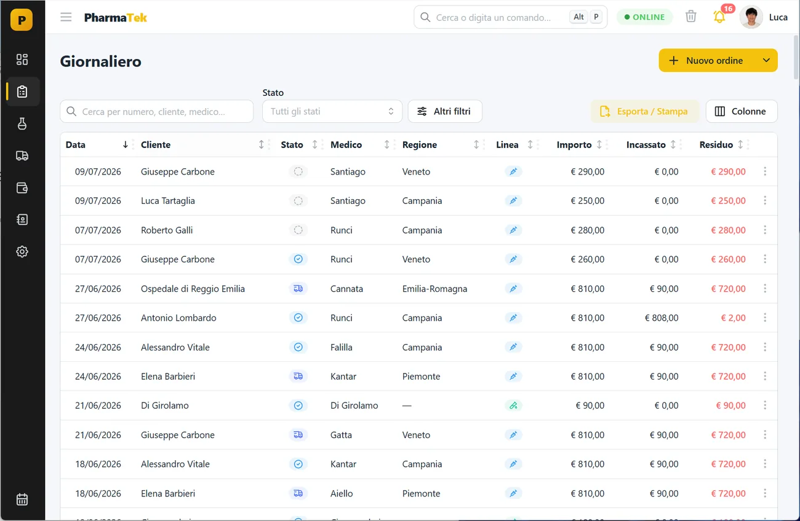
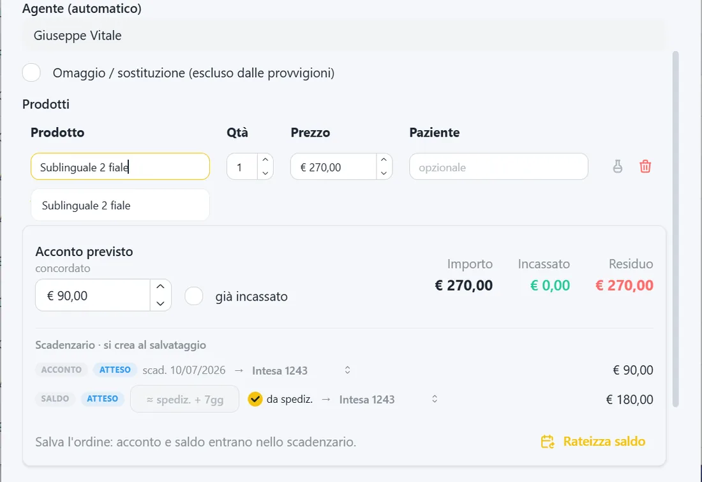
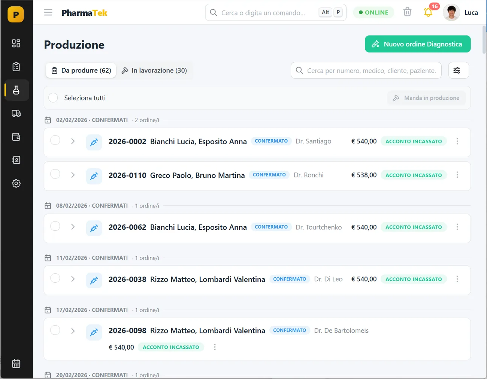
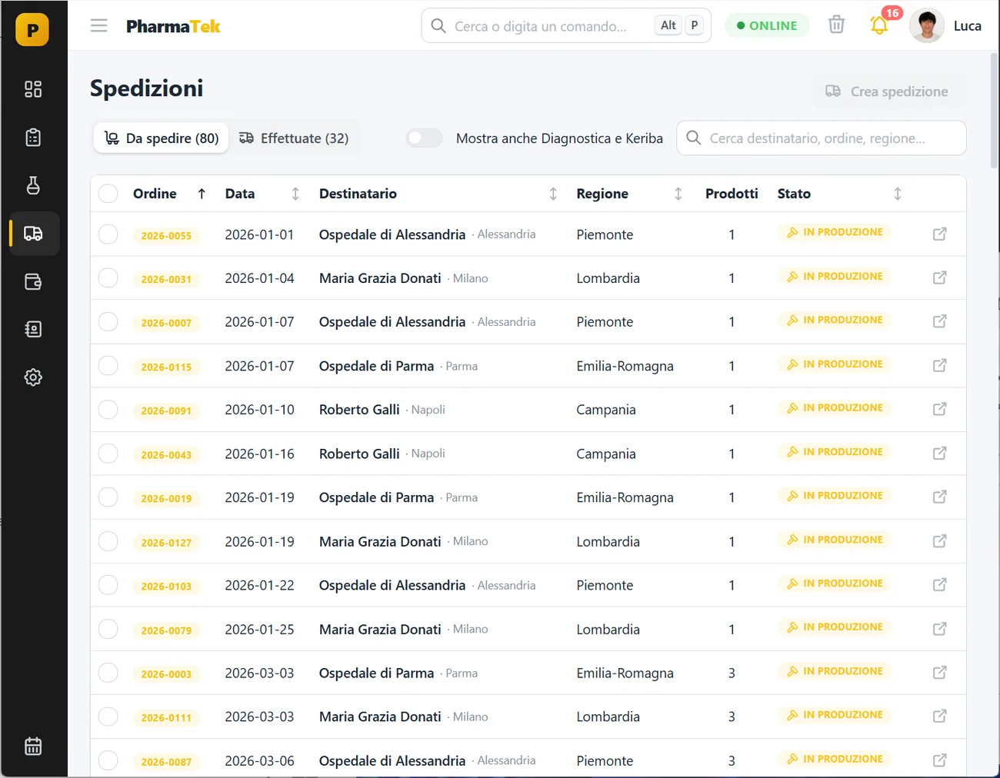
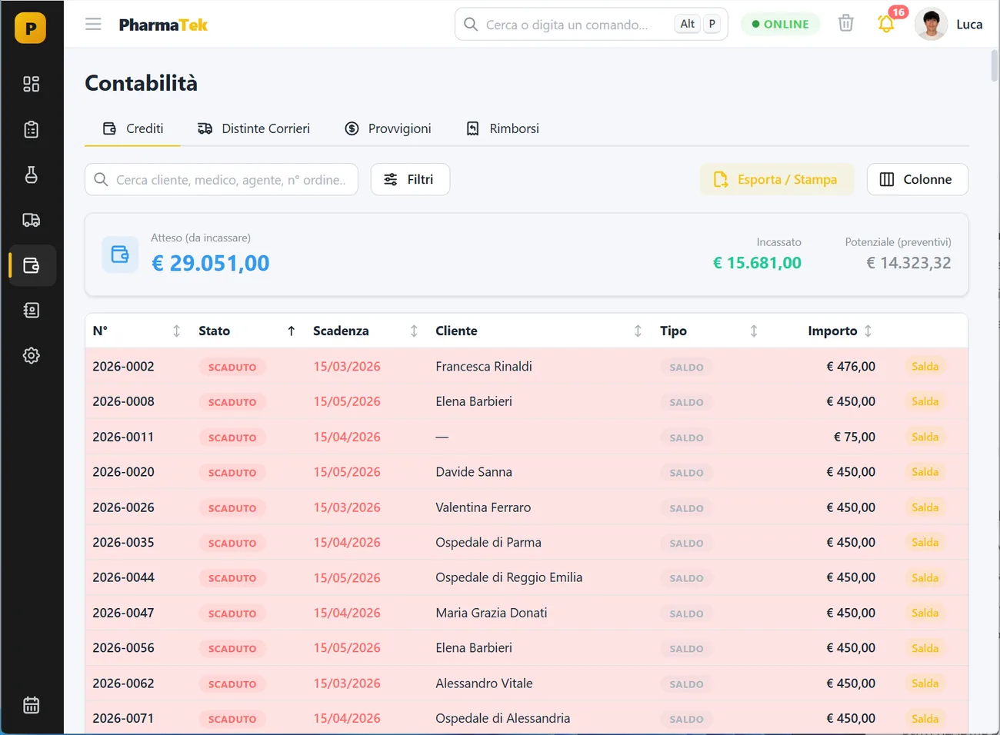
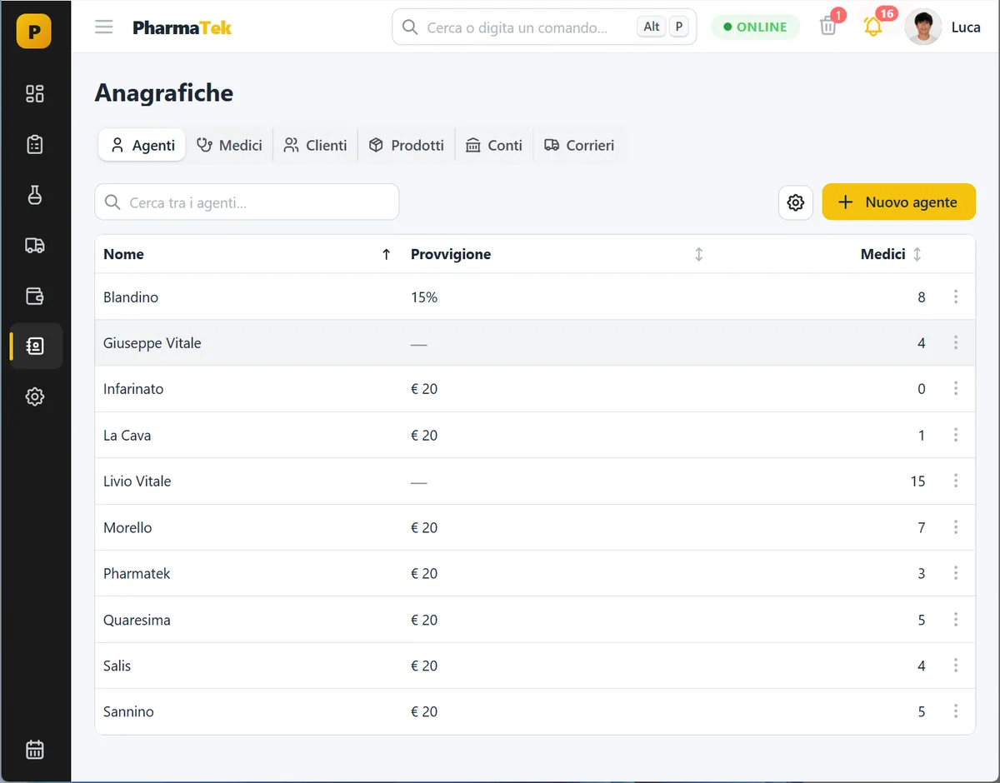
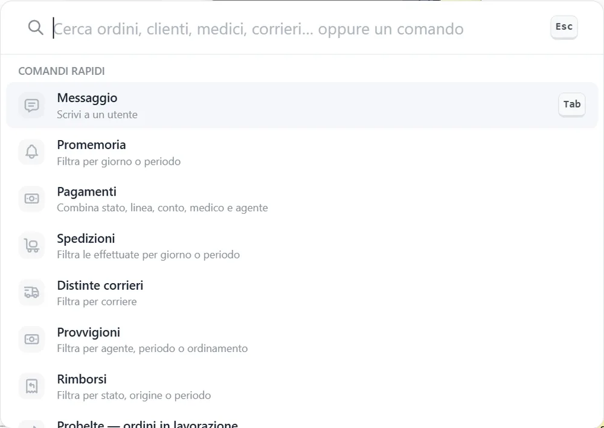
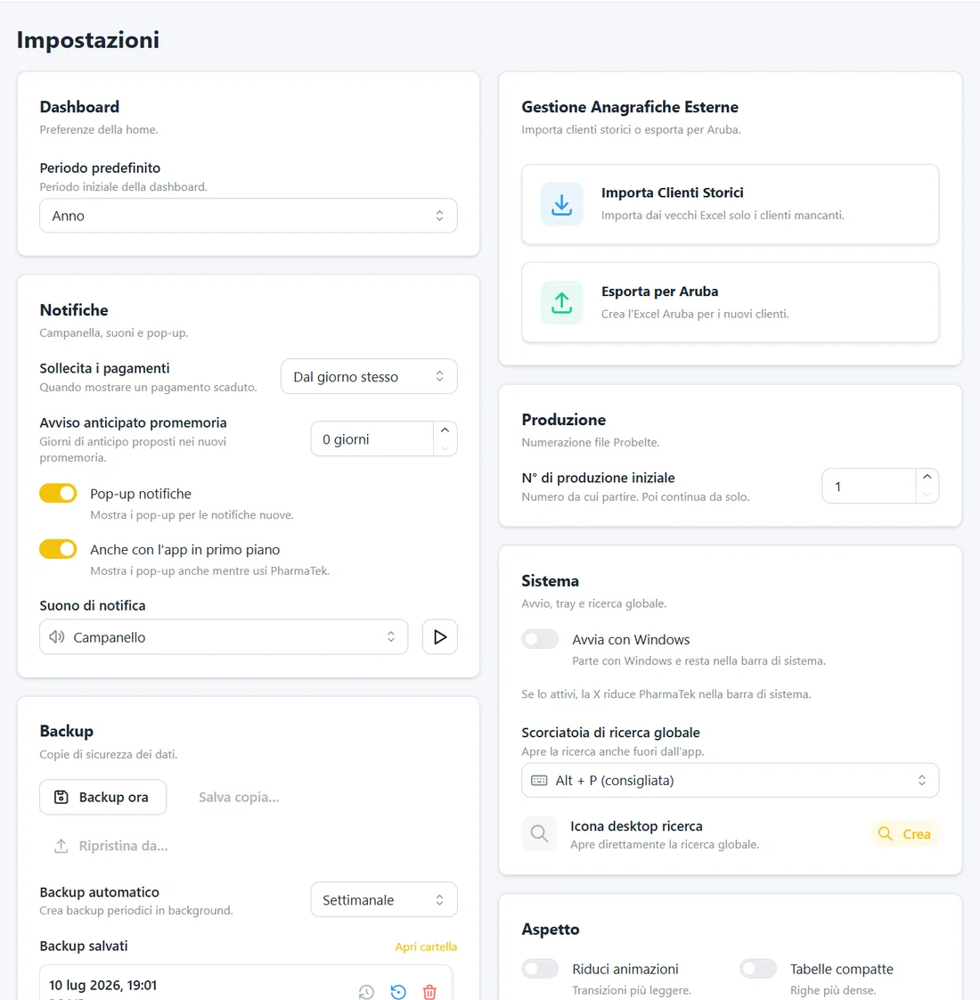
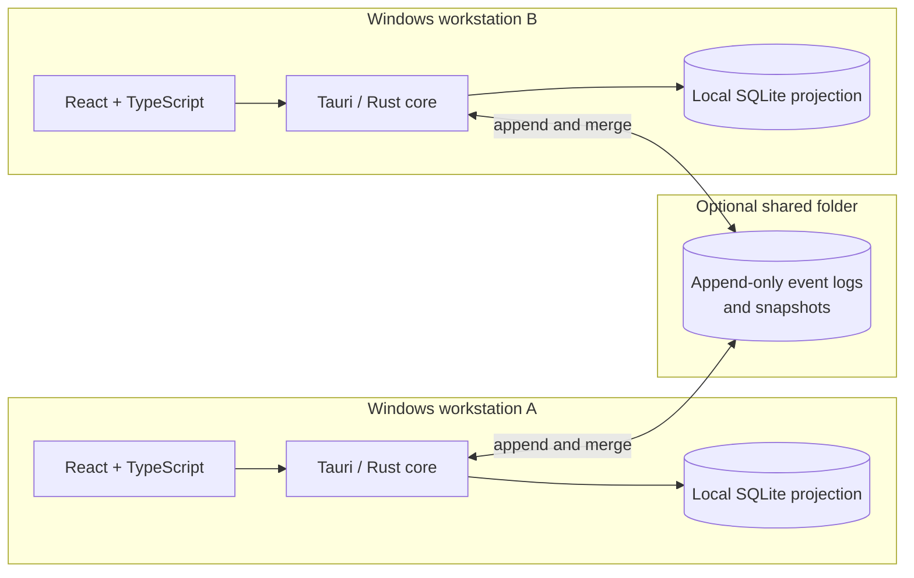

<div align="center">


# Gestionale PharmaTek Demo

**A local-first Windows workspace for the complete order lifecycle: from customer entry to production, shipping and payment.**

[**English**](README.md) · [Italiano](README.it.md)

<br />


</div>

> [!IMPORTANT]
> This is the public demonstration edition. It contains no operational company data, contacts, prices, supplier codes, commissions or financial coordinates. Initial records are empty and can be configured locally from the application.

<a href="docs/screenshots/readme/dashboard.webp">
  
</a>

## What is Gestionale PharmaTek?

Gestionale PharmaTek is a purpose-built desktop application that brings daily orders, production, shipments, payments, commissions and customer records into a single workflow.

An order entered in **Giornaliero** supplies the information needed by **Produzione**, becomes available in **Spedizioni**, and remains connected to its expected and received payments in **Contabilità**. The Dashboard, suggested actions and shared reminders make unfinished work visible without duplicating it elsewhere.

The application runs on Windows and remains usable offline. Each workstation reads and writes a fast local SQLite projection, while changes can be exchanged through a shared folder. No application server is required.

## From order to payment

| Step | Where | What happens |
|---:|---|---|
| 1 | **Giornaliero** | Create or update an order, select its records, add products and define prices, deposits and balances. |
| 2 | **Produzione** | Select complete order lines, fill in laboratory data and create a production batch. |
| 3 | **Spedizioni** | Group products by recipient, prepare parcels and export or print courier data. |
| 4 | **Contabilità** | Track expected payments, received money, instalments, commissions and refunds. |

Every saved operation updates the connected views, so the same order does not need to be rewritten in independent files.

## Product tour

<table>
<tr>
<td width="50%" valign="top">
<a href="docs/screenshots/readme/orders.webp"></a><br />
<sub><b>Daily orders.</b> Search, filters, operational status, totals, received amounts and remaining balances in one register.</sub>
</td>
<td width="50%" valign="top">
<a href="docs/screenshots/readme/order-editor.webp"></a><br />
<sub><b>Guided order entry.</b> Products, deposits, balances and payment schedules are calculated from the saved order data.</sub>
</td>
</tr>
<tr>
<td width="50%" valign="top">
<a href="docs/screenshots/readme/production.webp"></a><br />
<sub><b>Production.</b> Separate orders waiting to be processed from batches already in progress.</sub>
</td>
<td width="50%" valign="top">
<a href="docs/screenshots/readme/shipping.webp"></a><br />
<sub><b>Shipping.</b> Build parcels from ready products, confirm recipients and retain shipment history.</sub>
</td>
</tr>
<tr>
<td width="50%" valign="top">
<a href="docs/screenshots/readme/accounting.webp"></a><br />
<sub><b>Accounting.</b> Expected, overdue and received payments stay linked to the relevant order and account.</sub>
</td>
<td width="50%" valign="top">
<a href="docs/screenshots/readme/records.webp"></a><br />
<sub><b>Shared records.</b> Customers, doctors, agents, products, accounts and couriers feed the operational modules.</sub>
</td>
</tr>
<tr>
<td width="50%" valign="top">
<a href="docs/screenshots/readme/spotlight.webp"></a><br />
<sub><b>Spotlight.</b> Find orders and records or start a command from anywhere.</sub>
</td>
<td width="50%" valign="top">
<a href="docs/screenshots/readme/settings.webp"></a><br />
<sub><b>Settings and safety.</b> Notifications, imports, backups, appearance and workstation preferences.</sub>
</td>
</tr>
</table>

## Main capabilities

| Area | Capabilities |
|---|---|
| **Dashboard** | Year-aware indicators, charts, suggested actions, team board and recurring reminders. |
| **Orders** | Multiple product flows, status tracking, urgency markers, pricing, deposits, instalments and notes. |
| **Production** | Ready/in-progress queues, required line data, batch numbering and planned dates. |
| **Shipping** | Recipient grouping, parcel creation, cash on delivery, courier profiles, export and history. |
| **Accounting** | Expected and received movements, payment plans, commissions, refunds and reconciliation. |
| **Communications** | Email and messaging workflows, shared templates, local campaigns and controlled retries. |
| **Records** | Customers, doctors, agents, products, accounts and couriers, with import and deduplication tools. |
| **Operations** | Backups, coordinated restore, signed public updates and in-app release notes. |

## Why local-first?

- **Fast everyday use:** tables and searches read from a local SQLite projection.
- **Offline continuity:** a temporary network interruption does not stop data entry.
- **No central application server:** a shared folder can exchange changes between authorised workstations.
- **Convergent edits:** append-only event logs are merged at field level using Last-Write-Wins rules and a Hybrid Logical Clock.
- **Recoverable operations:** snapshots, backups, coordinated restore and the recycle bin cover different recovery needs.



## Public demo safeguards

- Separate application name and identifier: `Gestionale PharmaTek Demo` / `it.pharmatek.gestionale.demo`.
- Empty initial records for customers, doctors, agents, accounts and named couriers.
- Product taxonomy retained, with prices and supplier codes left empty.
- Synthetic documentation identifiers such as `Cliente Demo 001`, `Medico Demo 001` and `Paziente Demo 001`.
- Anonymous downloads from this repository's GitHub Releases, with no frontend update token.
- Premium demo features available locally and no remote control switch.

More details are available in [`docs/DEMO.md`](docs/DEMO.md).

## Developer quick start

### Requirements

- Node.js and npm
- Rust and Cargo through [rustup](https://rustup.rs)
- Visual Studio C++ Build Tools for the MSVC linker
- Microsoft Edge WebView2, normally included with Windows 11

### Run the application

```powershell
npm install
npm run app:dev
```

Run only the browser UI with `npm run dev`.

### Verify a change

```powershell
npm test
npm run build
cargo test --manifest-path src-tauri/Cargo.toml
npm run audit:public
```

## Repository map

```text
src/                     React and TypeScript interface
src-tauri/               Rust core and Tauri desktop integration
scripts/                 development, verification, build and release tools
docs/                    public demo notes and synthetic dataset
```

## License

No license is granted. This repository intentionally contains no `LICENSE` file.

---

<div align="center">
<sub>Gestionale PharmaTek Demo · A privacy-safe public demonstration build.</sub>
</div>
